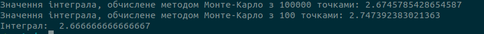

Результат роботи програми:

У даному випадку, можна побачити, що отримане значення інтеграла методом Монте-Карло добре збігається з аналітичним розрахунком, якщо брати значення розраховане для 100000 точок. Якщо взяти згначення розраховане для 100 точок, то можна побачити дуже велику похибку. Збільшення кількості точок дозволяє отримати більш точний результат. 